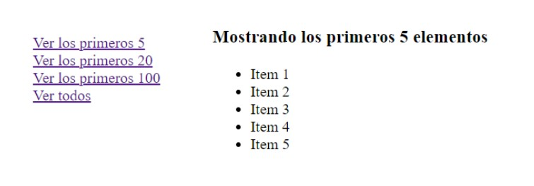
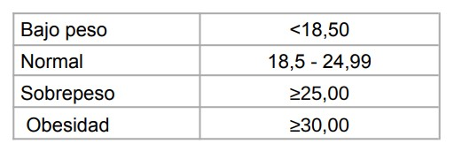

# Trabajo practico 1 (INTRO PHP)

Nota: Las entradas de los ejercicios deben ser cargadas desde un formulario HTML.

## Links utiles
### 📖 Documentacion
* [Atributo autocomplete](https://developer.mozilla.org/es/docs/Web/Security/Securing_your_site/Turning_off_form_autocompletion)

## Tabla de contenido
1. [Ejercicio 1](#ejercicio1);
2. [Ejercicio 2](#ejercicio2);
3. [Ejercicio 3](#ejercicio3);
4. [Ejercicio 4](#ejercicio4);
5. [Ejercicio 5](#ejercicio5);
6. [Ejercicio 6](#ejercicio6);
7. [Ejercicio 7](#ejercicio7);
8. [Ejercicio 8](#ejercicio8);
9. [Ejercicio 9](#ejercicio9);
10. [Ejercicio 10](#ejercicio10);
11. [Ejercicio 11](#ejercicio11);

### Ejercicio_1
Escriba un script php que muestre una página html completa generada desde el servidor con un encabezado de primer nivel (h1) con el famoso “Hola mundo!”.
  * A) ¿Qué extensión debe tener la página?
  * B) Lo que acabas de hacer: ¿Es una página dinámica o una página estática? ¿Cuáles la diferencia?
  * C) ¿Por qué es necesario tener un servidor web para realizar esto?

🔼 [Volver a la tabla](#tabla-de-contenido)

### Ejercicio_2
Escribir un programa que muestre una lista html generada desde el servidor a través de un arreglo. Identifique las diferencias entre arreglos asociativos e indexados. ([ver documentacion oficial](https://www.php.net/manual/es/language.types.array.php))

🔼 [Volver a la tabla](#tabla-de-contenido)

### Ejercicio_3
Escribir un programa que mediante un formulario html un usuario pueda ingresar su nombre, apellido y edad para que sean enviados al servidor. El programa, debe recibir
los datos y mostrar la información por pantalla.
  * A) Envíe el formulario usando los métodos POST y GET. ¿Cuál es la diferencia? ¿En qué situaciones considera mejor utilizar uno u el otro?
  * B) Investigue las diferencias entre los arreglos $_POST $_GET y $_REQUEST de PHP.
  * C) Genere validaciones de datos en el servidor. Ningún campo puede estar vacío. ¿Cuál es la diferencia entre realizar estas verificaciones del lado del cliente o del
lado del servidor?

🔼 [Volver a la tabla](#tabla-de-contenido)

### Ejercicio_4
Modifique el ejercicio 2 para que el usuario mediante links html pueda ir modificando el tamaño de la lista generada. Por ejemplo:

🔼 [Volver a la tabla](#tabla-de-contenido)

### Ejercicio_5
Construir un programa que calcule el índice de masa corporal de una persona 
  ***
    (IMC = peso [kg] / altura [m]2) 
  ***

e informe el estado en el que se encuentra esa persona en función del valor de IMC.

**Nota**: El IMC por sí solo no es una herramienta de diagnóstico. Si tenés dudas,
consultá a un médico.

🔼 [Volver a la tabla](#tabla-de-contenido)

### Ejercicio_6
Imprimir la siguiente tabla de multiplicar generada automáticamente en PHP. Modifique el ejercicio para que el límite de la tabla sea ingresado por un usuario:

🔼 [Volver a la tabla](#tabla-de-contenido)

### Ejercicio_7
Una persona desea invertir dinero en un banco, el cual le otorga un % de interés mensual. Escribir un programa para simular la inversión que imprima cuál será la cantidad de dinero que esta persona tendrá mes a mes durante un año. Genere una tabla HTML para mostrar el resultado.

🔼 [Volver a la tabla](#tabla-de-contenido)

### Ejercicio_8
Crear una calculadora básica server side. Esta calculadora debe permitir generar operaciones básicas dado dos números leídos desde un formulario. Ademas, se deberá incluir una barra de navegación para:
* Acceder a una sección número pi: esta sección debe mostrar mostrar una descripción de lo que representa este número y su valor. Investigue diferentes formas de obtener este valor en PHP.
* Acceder a una sección about que indique los creadores de la calculadora. Si le indicamos con un parametro un desarrollador en particular debe mostrar solo eso. Por ejemplo:
  *** 
      about.php?developer = juan
  ***

🔼 [Volver a la tabla](#tabla-de-contenido)

### Ejercicio_9
Modifique el ejercicio 3 para agregar elementos avanzados al formulario. Investigue cómo se envían y reciben este tipo de datos:

* A) Género (radiobutton - una sola opción)
* B) País (select - una sola opción)
* C) Intereses: (checkbox - selección múltiple) Investigue el uso de array en losinputs.

🔼 [Volver a la tabla](#tabla-de-contenido)

### Ejercicio_10
Modifique el ejercicio 3 para que el programa sea llamado mediante AJAX.

🔼 [Volver a la tabla](#tabla-de-contenido)

### Ejercicio_11
Modifique el ejercicio 4 para separar la lista de la “botonera” mediante AJAX.

🔼 [Volver a la tabla](#tabla-de-contenido)